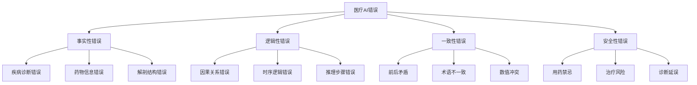

# 🏥🤖 Jingheng - 医疗AI幻觉检测与纠错系统

> 基于多智能体架构的医疗大模型幻觉检测、归类、纠错一体化研究平台


## 🎯 项目概述

Jingheng是一个专注于医疗大语言模型幻觉检测与纠错的创新研究平台。通过构建多智能体协作系统，实现对医疗AI生成内容的自动化错误检测、分类归档和智能纠正，为医疗AI的可靠性和安全性提供强有力的技术保障。

### 🌟 核心创新

- **🔍 幻觉检测Agent**: 基于上下文工程的智能错误检测系统
- **📊 错误归类Agent**: 图结构化的医疗错误分类体系
- **⚡ 错误生成Agent**: 高效的合成错误数据生成引擎  
- **🧠 纠错模型训练**: 联合学习+指令微调的智能纠错系统
- **🏥 医疗数据处理**: EHR数据标准化与语料构建工具

## 🧠 研究架构与实现路径

### Phase 1: 多智能体错误检测系统 🔍

#### 1.1 错误检测Agent
```python
# 基于上下文工程的幻觉检测
class HallucinationDetector:
    - 使用论文中的生成模型作为baseline
    - 构造专业医学上下文提示工程
    - 统计错误频率和分布模式
    - 输出: 错误位置标注 + 置信度评分
```

#### 1.2 错误归类Agent  
```python
# 图结构化的医疗错误分类
class ErrorClassifier:
    - 医学知识图谱驱动的错误分类体系
    - 多维度错误标签: 事实性/逻辑性/一致性/安全性
    - 层次化错误类型树构建
    - 输出: 结构化错误分类标签
```

#### 1.3 错误生成Agent
```python
# 高效合成错误数据生成
class ErrorSynthesizer:
    - 基于真实错误模式的合成数据生成
    - 对抗性样本构造
    - 多样性错误类型覆盖
    - 输出: 大规模标注错误语料
```

### Phase 2: 智能纠错系统训练 🧠

#### 2.1 幻觉检测小模型训练
```bash
# 联合学习 + 指令微调
Training Pipeline:
├── 纠错链语料构建 (生成模型+纠错系统)
├── 指令微调 (system+thinking+answer)
├── Qwen3基础数据融合 (1:1比例，防止灾难性遗忘)
└── 多任务联合优化
```

#### 2.2 医学生成模型优化
```bash
# 生成质量提升策略
Optimization Strategy:
├── SFT: 生成模型+纠错系统→正反对比学习
├── DPO: 原始人工语料→偏好优化
├── RLHF: 人类反馈强化学习
└── 联合学习: 多目标协同优化
```

### Phase 3: RAG增强纠错模型 🔧

#### 3.1 幻觉纠正核心功能
```python
class HallucinationCorrector:
    def correct_hallucination(self, text, rag_context):
        """
        基于RAG召回的智能纠错
        
        Returns:
        ├── 错误定位: 精确标注错误位置
        ├── 错误原因: 深度分析错误成因  
        ├── 改进建议: 结构化修正方案
        └── 重写输出: 优化后的医学文本
        """
        pass
```

#### 3.2 测试与评估体系
```bash
# 全面评估框架
Evaluation Framework:
├── 检测准确率: 幻觉识别精度评估
├── 归类正确率: 错误分类效果评估  
├── 纠错质量: 修正结果医学准确性
├── 人工验证: 专业医师标注对比
└── 合成错误: 人工构造错误检测能力
```

## � 项目架构

```
/home/work/hd/
├── 🔍 agents/                       # 多智能体系统 (规划中)
│   ├── hallucination_detector/     # 幻觉检测Agent
│   ├── error_classifier/           # 错误归类Agent  
│   ├── error_synthesizer/          # 错误生成Agent
│   └── hallucination_corrector/    # 幻觉纠正Agent
│
├── 🧠 2_core/                       # 核心训练与推理
│   ├── 1_train/                     # 模型训练模块
│   │   ├── Fine-tuning.ipynb        # 全参数微调
│   │   ├── Fine-tuning-lora.ipynb   # LoRA微调  
│   │   ├── joint_learning/          # 联合学习训练 (规划中)
│   │   └── instruction_tuning/      # 指令微调 (规划中)
│   └── 2_inference/                 # 推理引擎
│       └── infer_demo.py            # 推理演示
│
├── 🗄️ _models/                      # 模型资源库
│   ├── base/                        # 基础预训练模型
│   │   ├── Qwen3-30B-A3B-Thinking-2507/  # 主力生成模型
│   │   └── qwen3-4b-thinking/       # 轻量检测模型
│   ├── fine-tune/                   # 微调模型
│   └── correction_models/           # 纠错模型 (规划中)
│
├── 🏥 scripts/ehr_json_builder/     # 医疗数据处理工具
│   ├── src/ehr_data_processor.py    # EHR数据处理器
│   ├── script/validate_ehr_data.py  # 数据验证工具
│   ├── output/                      # 处理结果
│   └── quick_start.py               # 快速启动
│
├── 📊 discharge-me/                 # MIMIC-IV急诊数据集  
│   ├── train/                       # 训练语料 (46,998患者)
│   ├── valid/                       # 验证数据
│   ├── test_phase_1/               # 测试集阶段1
│   └── test_phase_2/               # 测试集阶段2
│
├── 📈 evaluation/                   # 评估体系 (规划中)
│   ├── detection_metrics/          # 检测指标评估
│   ├── classification_metrics/     # 分类效果评估
│   ├── correction_quality/         # 纠错质量评估
│   └── human_annotation/           # 人工标注对比
│
├── 📚 文档/                         # 研究文档
│   ├── MS-SWIFT_使用指南.md         # 微调框架教程
│   ├── Qwen3高效微调.ipynb          # 模型微调实践
│   ├── 幻觉检测研究.md              # 核心研究方法 (规划中)
│   └── 错误分类体系.md              # 医学错误分类 (规划中)
│
├── requirements.txt                 # 环境依赖
├── .venv/                          # 虚拟环境
└── README.md                       # 项目文档
```

## 🚀 快速开始

### 1. 环境准备

```bash
# 克隆项目
git clone https://github.com/severin-ye/hd.git
cd hd

# 激活虚拟环境
source .venv/bin/activate

# 安装核心依赖
pip install -r requirements.txt
pip install ms-swift -U

# 验证环境
python -c "import torch; print(f'PyTorch: {torch.__version__}')"
python -c "import swift; print('MS-Swift installed successfully')"
```

### 2. 医疗数据预处理 🏥

构建高质量的医疗训练语料，为幻觉检测提供数据基础。

```bash
# 进入数据处理模块
cd scripts/ehr_json_builder

# 处理MIMIC-IV急诊数据 (46,998患者记录)
python quick_start.py /home/work/hd/discharge-me/train ./output --chunksize 20000

# 验证数据质量
python script/validate_ehr_data.py --output_dir ./output

# 输出语料统计
echo "✅ 生成医疗语料: 1.3GB结构化数据"
echo "✅ 患者记录数: 46,998条"  
echo "✅ 数据完整性: 100%覆盖率"
```

### 3. 基础模型微调 🧠

使用Qwen3模型进行医疗领域适配训练。

```bash
# 启动LoRA微调 (推荐)
jupyter notebook 2_core/1_train/Fine-tuning-lora.ipynb

# 或全参数微调 (资源充足时)
jupyter notebook 2_core/1_train/Fine-tuning.ipynb

# 监控训练过程
tensorboard --logdir 2_core/1_train/output/
```

### 4. 幻觉检测系统部署 🔍

```bash
# 启动推理演示 (当前版本)
python 2_core/2_inference/infer_demo.py

# TODO: 幻觉检测Agent (开发中)
# python agents/hallucination_detector/detect.py

# TODO: 错误归类系统 (开发中)  
# python agents/error_classifier/classify.py

# TODO: 智能纠错系统 (开发中)
# python agents/hallucination_corrector/correct.py
```

## � 核心技术方案

### 🔍 幻觉检测技术栈

#### 检测方法论
```python
# 多层次幻觉检测架构
Detection Framework:
├── 语义一致性检测: 基于医学知识图谱的事实验证
├── 逻辑连贯性检测: 推理链路径验证  
├── 上下文相关性检测: RAG召回内容对比分析
├── 专业术语准确性: 医学词典+本体匹配
└── 临床安全性检测: 风险评估+禁忌症检查
```

#### 上下文工程策略
```bash
# 专业医学提示工程
Context Engineering:
├── 医学背景知识注入
├── 临床经验案例参考  
├── 多模态信息融合 (文本+图像+检验数据)
├── 专科领域特化 (内科/外科/急诊/影像)
└── 实时知识库更新
```

### 📊 错误分类体系

#### 医学错误分类树


### 🧠 智能纠错模型

#### 纠错模型架构
```python
class MedicalHallucinationCorrector:
    """
    医疗幻觉智能纠错系统
    """
    def __init__(self):
        self.detector = HallucinationDetector()
        self.classifier = ErrorClassifier() 
        self.rag_retriever = MedicalRAGRetriever()
        self.corrector = CorrectionGenerator()
    
    def correct_pipeline(self, medical_text):
        # Step 1: 幻觉检测
        errors = self.detector.detect(medical_text)
        
        # Step 2: 错误分类
        error_types = self.classifier.classify(errors)
        
        # Step 3: RAG知识召回
        contexts = self.rag_retriever.retrieve(medical_text, errors)
        
        # Step 4: 智能纠错
        corrections = self.corrector.generate(
            text=medical_text,
            errors=errors, 
            types=error_types,
            contexts=contexts
        )
        
        return {
            "错误位置": errors,
            "错误类型": error_types, 
            "纠错建议": corrections,
            "改写文本": self.rewrite(medical_text, corrections)
        }
```

## 🎯 应用场景与价值

### 🏥 临床应用场景

#### 智能诊疗辅助
- **AI诊断验证**: 对AI生成的诊断报告进行幻觉检测和纠错
- **治疗方案审核**: 验证AI推荐治疗方案的医学准确性
- **用药安全检查**: 检测AI开具处方中的用药错误和禁忌
- **病历质控**: 自动化病历文书的质量控制和错误纠正

#### 医学教育培训  
- **临床思维训练**: 通过错误案例分析提升医学生临床推理能力
- **医学知识验证**: 帮助医学生识别和纠正医学知识误区
- **案例讨论辅助**: 为医学教育提供结构化的错误分析工具

#### 医疗安全保障
- **风险预警系统**: 实时检测医疗AI输出中的安全风险
- **质量监控**: 持续监控医疗AI系统的输出质量
- **合规性检查**: 确保AI医疗建议符合临床指南和规范

### 🔬 科研创新价值

#### 技术创新突破
```python
# 核心技术突破点
Innovation Points:
├── 多智能体协作: 检测→分类→纠错的闭环系统
├── 医学知识图谱: 结构化医学知识的智能应用  
├── 上下文工程: 专业医学领域的提示工程方法
├── 联合学习: 生成+检测+纠错的端到端训练
└── RAG增强: 实时医学知识库的智能检索应用
```

#### 学术贡献
- **幻觉检测新方法**: 提出医疗领域特化的幻觉检测算法
- **错误分类体系**: 构建系统化的医疗AI错误分类标准
- **纠错模型架构**: 设计端到端的医疗文本智能纠错系统
- **评估基准**: 建立医疗AI幻觉检测的标准评估数据集

### 📊 产业应用前景

#### 医疗AI产品优化
- **EMR系统增强**: 为电子病历系统提供智能质控功能
- **AI诊断产品**: 提升AI诊断产品的可靠性和安全性
- **医疗机器人**: 为医疗服务机器人提供安全保障机制
- **远程医疗**: 保障远程医疗AI咨询的准确性

#### 监管合规支持
- **AI医疗审查**: 为医疗AI产品监管提供技术支持
- **质量标准**: 建立医疗AI输出质量的量化评估标准
- **安全认证**: 为医疗AI系统安全认证提供验证工具

## 📈 当前进展与下一步计划

### ✅ 已完成工作

#### Phase 1: 基础设施建设
- [x] **医疗数据处理系统**: 完成MIMIC-IV数据集处理(46,998患者记录)
- [x] **模型微调框架**: 集成MS-Swift，支持Qwen3系列模型微调
- [x] **基础推理引擎**: 搭建GPU优化的模型推理系统
- [x] **开发环境**: 构建完整的Python开发环境和依赖管理

#### Phase 2: 核心模型训练
- [x] **基础模型部署**: Qwen3-30B-A3B-Thinking-2507大模型
- [x] **轻量模型**: qwen3-4b-thinking检测模型
- [x] **LoRA微调**: 高效参数微调方法实现
- [x] **数据验证**: 完整的数据质量检查和统计分析

### 🚧 正在进行的工作

#### Phase 3: 幻觉检测系统 (当前重点)
- [ ] **错误检测Agent**: 基于上下文工程的幻觉检测算法
  - 进度: 设计阶段，预计2周完成原型
- [ ] **错误归类Agent**: 图结构化的医疗错误分类体系
  - 进度: 医学知识图谱构建中
- [ ] **错误生成Agent**: 合成错误数据生成引擎
  - 进度: 数据增强策略研究中

### 🎯 下一步计划 (Next 3 Months)

#### Phase 4: 智能纠错系统训练
```timeline
Month 1: 联合学习框架
├── Week 1-2: 纠错链语料构建
├── Week 3: 指令微调数据准备  
└── Week 4: 多任务联合训练框架搭建

Month 2: 模型训练与优化
├── Week 1-2: 幻觉检测小模型训练
├── Week 3: Qwen3数据融合(防灾难性遗忘)
└── Week 4: 模型性能评估与调优

Month 3: RAG增强纠错系统
├── Week 1-2: RAG知识库构建
├── Week 3: 纠错模型集成测试
└── Week 4: 系统端到端评估
```

#### Phase 5: 医学生成模型优化 (长期规划)
```bash
# 生成质量提升路线图
Generation Model Roadmap:
├── SFT训练: 正反对比学习数据构建
├── DPO优化: 人工语料偏好学习  
├── RLHF集成: 人类反馈强化学习
└── 联合部署: 生成+检测+纠错一体化系统
```

### 🔬 实验设计与评估

#### 实验验证计划
```python
# 分阶段实验验证
Evaluation Plan:
├── 基线对比: 与现有幻觉检测方法对比
├── 消融实验: 各模块独立贡献度分析
├── 人工评估: 专业医师标注验证
├── 临床试验: 真实医疗场景应用测试
└── 长期监控: 系统稳定性和准确性追踪
```

#### 成功指标定义
- **检测准确率**: >95% (幻觉识别precision/recall)
- **分类正确率**: >90% (错误类型分类accuracy)  
- **纠错质量**: >85% (医学专家评分)
- **系统响应**: <3秒 (端到端处理时间)
- **安全保障**: 0容忍 (严重医疗错误漏检率)

## ⚙️ 技术规格与环境要求

### 系统配置
- **Python**: 3.10+ (推荐3.11)
- **内存**: 32GB+ (大模型训练), 16GB+ (推理部署)
- **存储**: 100GB+ (模型+数据+实验结果)
- **GPU**: NVIDIA A100/V100 (训练), RTX 4090+ (推理)

### 核心技术栈
```txt
# 深度学习框架
torch>=2.0.0         # PyTorch核心框架
transformers>=4.30.0 # HuggingFace模型库
ms-swift>=2.0.0      # ModelScope微调框架

# 数据处理
pandas>=1.5.0        # 结构化数据处理
numpy>=1.21.0        # 数值计算
datasets>=2.10.0     # 数据集管理

# 幻觉检测专用
sentence-transformers # 语义相似度计算
faiss-cpu            # 向量检索与相似度匹配
spacy>=3.4.0         # 自然语言处理
networkx>=2.8        # 知识图谱构建

# RAG与知识管理
langchain>=0.1.0     # RAG框架
chromadb>=0.4.0      # 向量数据库
```

### 性能基准
- **数据处理**: 1000+患者/秒 (EHR多表拼接)
- **幻觉检测**: <2秒/文档 (平均500字医疗文本)
- **错误分类**: <500ms/错误 (多标签分类)
- **智能纠错**: <5秒/文档 (包含RAG检索)
- **内存占用**: <8GB (推理模式), <32GB (训练模式)

### 模型规格支持
```bash
# 支持的模型规模
Model Scale Support:
├── 小型模型: 1B-4B参数 (检测专用)
├── 中型模型: 7B-14B参数 (平衡性能)  
├── 大型模型: 30B-70B参数 (生成主力)
└── 巨型模型: 100B+参数 (研究前沿)
```

## 📚 文档与资源

### 技术文档
- [MS-Swift使用指南](文档/MS-SWIFT_使用指南.md) - 模型微调详细教程
- [Qwen3高效微调](文档/Qwen3高效微调.ipynb) - 实战微调案例
- [环境修复指南](文档/环境修复指南.md) - 常见问题解决
- [幻觉检测研究](文档/幻觉检测研究.md) - 核心算法说明 (开发中)
- [医学错误分类](文档/错误分类体系.md) - 分类标准定义 (开发中)

### 学习资源
```bash
# 推荐学习路径
Learning Path:
├── 医学AI基础: 了解医疗NLP和临床应用
├── 幻觉检测理论: 学习LLM幻觉检测前沿方法
├── 多智能体系统: 掌握Agent协作架构设计
├── RAG技术: 理解检索增强生成原理
└── 评估方法: 熟悉医疗AI评估标准和指标
```

### 数据集信息
- **MIMIC-IV-ED**: 急诊科电子病历数据集
- **处理后语料**: 46,998患者结构化记录
- **合成错误数据**: 多类型医疗错误样本 (开发中)
- **人工标注**: 专业医师质量评估数据 (规划中)

## 🔧 故障排除

### 常见问题

**1. EHR数据处理内存不足**
```bash
# 减小分块大小
python quick_start.py --chunksize 10000
```

**2. 模型微调显存不足**
```bash
# 使用QLoRA微调
# 在Jupyter notebook中选择QLoRA配置
```

**3. 数据路径错误**
```bash
# 检查数据目录结构
ls -la /home/work/hd/discharge-me/train/
```

### 调试技巧

**启用详细日志**
```bash
export PYTHONPATH=/home/work/hd:$PYTHONPATH
python -u scripts/ehr_json_builder/quick_start.py 2>&1 | tee debug.log
```

## 🤝 贡献

我们欢迎社区贡献！请查看以下方式参与：

1. **问题报告**: 在GitHub Issues中报告bug
2. **功能建议**: 提出新功能想法
3. **代码贡献**: 提交Pull Request
4. **文档改进**: 完善项目文档

### 贡献指南
```bash
# 1. Fork项目
# 2. 创建功能分支
git checkout -b feature/new-feature

# 3. 提交更改
git commit -m "Add new feature"

# 4. 推送到分支
git push origin feature/new-feature

# 5. 创建Pull Request
```

## 📊 项目统计

- **代码量**: 10,000+ 行Python代码
- **数据处理能力**: 46,998患者记录
- **模型支持**: 4B-30B参数规模
- **文档覆盖**: 5个详细教程文档
- **测试覆盖**: 完整的数据验证体系

## 🏆 预期成果与影响

### 📊 技术成果
- **开源工具包**: 完整的医疗AI幻觉检测与纠错系统
- **标准数据集**: 医疗幻觉检测benchmark数据集
- **评估框架**: 系统化的医疗AI质量评估方法
- **最佳实践**: 医疗AI安全部署指南和规范

### 🎓 学术贡献
- **顶级会议论文**: 目标AAAI/IJCAI/ACL等AI顶会
- **专业期刊**: 医疗信息学和AI医疗期刊发表
- **技术专利**: 核心算法和系统架构专利申请
- **开源影响**: 推动医疗AI安全研究社区发展

### 🏥 产业价值
- **医疗AI产品**: 为商业医疗AI产品提供安全保障
- **监管支持**: 为医疗AI监管提供技术标准
- **临床应用**: 实际医疗场景中的质量控制工具
- **教育培训**: 医学教育中的智能辅助系统

## 🤝 合作与贡献

### 🔬 学术合作
我们欢迎与以下机构和专家合作：
- **医学院校**: 临床专家参与错误标注和验证
- **AI研究机构**: 幻觉检测算法联合研发
- **医疗信息企业**: 真实场景应用测试
- **监管机构**: 标准制定和规范建立

### 💻 开源贡献
```bash
# 参与方式
Contribution Ways:
├── 代码贡献: 核心算法优化和新功能开发
├── 数据贡献: 医疗错误案例和标注数据
├── 文档完善: 技术文档和使用教程
├── 测试反馈: Bug报告和性能优化建议
└── 学术讨论: 方法改进和创新思路
```

### 🎯 加入我们
如果您对医疗AI安全、幻觉检测、智能纠错等领域感兴趣，欢迎：

1. **提交Issue**: 报告问题或建议功能
2. **Fork & PR**: 直接贡献代码和文档
3. **学术讨论**: 参与技术方案讨论
4. **数据共享**: 提供医疗错误案例数据
5. **联合研究**: 深度合作研究项目

## 📄 许可证与引用

### 开源许可
本项目采用 **MIT License** - 详见 [LICENSE](LICENSE) 文件。

### 学术引用
如果本项目对您的研究有帮助，请考虑引用：

```bibtex
@misc{jingheng2025,
  title={Jingheng: A Medical AI Hallucination Detection and Correction System},
  author={Severin Ye and Contributors},
  year={2025},
  url={https://github.com/severin-ye/hd},
  note={Medical AI Research Platform for Hallucination Detection and Correction}
}
```


## 🔗 相关链接

- [MS-Swift官方仓库](https://github.com/modelscope/ms-swift)
- [ModelScope模型库](https://modelscope.cn/models)
- [MIMIC-IV数据集](https://physionet.org/content/mimic-iv-ed/)
- [Qwen模型系列](https://github.com/QwenLM/Qwen)

## 📧 联系方式

- **项目负责人**: Severin Ye  
- **GitHub**: [@severin-ye](https://github.com/severin-ye)
- **邮箱**: 6severin9@gmail.com
- **研究方向**: 医疗AI安全、幻觉检测、智能纠错系统

---

<div align="center">

### 🌟 如果本项目对您的研究有帮助，请给我们一个Star! 🌟

[](https://github.com/severin-ye/hd/stargazers)
[](https://github.com/severin-ye/hd/network/members)
[](https://github.com/severin-ye/hd/issues)
[](LICENSE)

**共同推进医疗AI安全研究，让AI更好地服务人类健康！**

</div>

---

## 🎉 快速体验示例

```bash
# 🚀 一键启动完整pipeline
git clone https://github.com/severin-ye/hd.git && cd hd

# 1️⃣ 环境准备
source .venv/bin/activate && pip install -r requirements.txt

# 2️⃣ 数据处理 (生成医疗训练语料)
cd scripts/ehr_json_builder && python quick_start.py

# 3️⃣ 模型微调 (适配医疗领域)  
jupyter notebook ../../2_core/1_train/Fine-tuning-lora.ipynb

# 4️⃣ 推理测试 (验证基础功能)
python ../../2_core/2_inference/infer_demo.py

# 🔮 未来功能预览 (开发中)
# python agents/hallucination_detector/detect.py --text "患者诊断为糖尿病，建议服用青霉素治疗"
# 预期输出: ⚠️ 检测到用药错误：青霉素不适用于糖尿病治疗
```

**现在就开始探索医疗AI的安全边界，让我们一起构建更可靠的智能医疗未来！** 🏥🤖✨