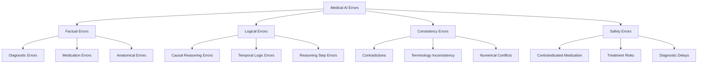

# 🏥🤖 CuraView — Medical AI Hallucination Detection & Correction System

**English** |[中文](README.zh-CN.md)

> An integrated research platform for hallucination detection, classification, and correction in medical large language models, based on a multi-agent architecture.

---

## 🎯 Project Overview

**CuraView** is an innovative research platform focusing on **hallucination detection and correction for medical large language models (LLMs)**.
By constructing a collaborative multi-agent system, it automates error detection, classification, and intelligent correction of AI-generated medical content — providing a robust technological foundation for the **reliability and safety of medical AI**.

### 🌟 Core Innovations

* **🔍 Hallucination Detection Agent** — A context-engineering-based intelligent error detection system
* **📊 Error Classification Agent** — A graph-structured medical error taxonomy
* **⚡ Error Synthesis Agent** — A high-efficiency synthetic error data generator
* **🧠 Correction Model Training** — A joint-learning and instruction-fine-tuned intelligent correction framework
* **🏥 Medical Data Processing** — EHR data standardization and corpus-building toolkit

---

## 🧠 Research Architecture & Implementation Path

### Phase 1: Multi-Agent Error Detection System 🔍

#### 1.1 Hallucination Detection Agent

```python
# Context-engineering-based hallucination detection
class HallucinationDetector:
    - Uses generation models from published papers as baselines
    - Builds domain-specific medical context prompt engineering
    - Collects statistics of error frequency and distribution
    - Output: error location annotations + confidence scores
```

#### 1.2 Error Classification Agent

```python
# Graph-structured medical error classification
class ErrorClassifier:
    - Knowledge-graph-driven medical error taxonomy
    - Multi-dimensional labels: factual / logical / consistency / safety
    - Hierarchical error-type tree construction
    - Output: structured error-classification labels
```

#### 1.3 Error Synthesis Agent

```python
# Efficient synthetic error-data generation
class ErrorSynthesizer:
    - Generates synthetic data based on real-world error patterns
    - Constructs adversarial samples
    - Covers diverse types of medical errors
    - Output: large-scale labeled erroneous corpus
```

---

### Phase 2: Intelligent Correction System Training 🧠

#### 2.1 Hallucination Detection Model Training

```bash
# Joint learning + instruction fine-tuning
Training Pipeline:
├── Correction-chain corpus construction (generator + corrector)
├── Instruction fine-tuning (system + thinking + answer)
├── Qwen3 base-data fusion (1:1 ratio, preventing catastrophic forgetting)
└── Multi-task joint optimization
```

#### 2.2 Medical Generation Model Optimization

```bash
# Generation-quality enhancement strategies
Optimization Strategy:
├── SFT: generator + corrector → contrastive learning
├── DPO: human-authored corpus → preference optimization
├── RLHF: reinforcement learning from human feedback
└── Joint learning: multi-objective collaborative optimization
```

---

### Phase 3: RAG-Enhanced Correction Model 🔧

#### 3.1 Core Correction Function

```python
class HallucinationCorrector:
    def correct_hallucination(self, text, rag_context):
        """
        Intelligent correction based on RAG retrieval
        
        Returns:
        ├── Error localization: precise annotation of error spans
        ├── Error cause: in-depth causal analysis
        ├── Correction advice: structured revision plan
        └── Rewritten output: optimized medical text
        """
        pass
```

#### 3.2 Testing & Evaluation Framework

```bash
# Comprehensive evaluation pipeline
Evaluation Framework:
├── Detection accuracy: hallucination identification precision
├── Classification accuracy: taxonomy effectiveness
├── Correction quality: medical accuracy of revisions
├── Human validation: comparison with clinician annotations
└── Synthetic-error testing: robustness on adversarial samples
```


## ⚙️ Core Technical Framework

### 🔍 Hallucination Detection Technology Stack

#### Detection Methodology

```python
# Multi-layer hallucination detection architecture
Detection Framework:
├── Semantic Consistency Check: Fact verification via medical knowledge graph  
├── Logical Coherence Check: Reasoning-chain validation  
├── Contextual Relevance Check: Comparison with RAG-retrieved context  
├── Terminology Accuracy Check: Medical dictionary and ontology matching  
└── Clinical Safety Check: Risk assessment and contraindication detection
```

#### Context Engineering Strategy

```bash
# Professional medical prompt engineering
Context Engineering:
├── Injection of medical background knowledge
├── Reference to clinical case studies  
├── Multimodal fusion (text + imaging + lab data)
├── Specialty customization (internal medicine / surgery / ER / radiology)
└── Real-time medical knowledge base updates
```

---

### 📊 Error Classification Framework

#### Medical Error Taxonomy



---

### 🧠 Intelligent Correction Model

#### Correction Model Architecture

```python
class MedicalHallucinationCorrector:
    """
    Intelligent correction system for medical hallucinations
    """
    def __init__(self):
        self.detector = HallucinationDetector()
        self.classifier = ErrorClassifier() 
        self.rag_retriever = MedicalRAGRetriever()
        self.corrector = CorrectionGenerator()
    
    def correct_pipeline(self, medical_text):
        # Step 1: Hallucination detection
        errors = self.detector.detect(medical_text)
        
        # Step 2: Error classification
        error_types = self.classifier.classify(errors)
        
        # Step 3: Knowledge retrieval (RAG)
        contexts = self.rag_retriever.retrieve(medical_text, errors)
        
        # Step 4: Intelligent correction
        corrections = self.corrector.generate(
            text=medical_text,
            errors=errors, 
            types=error_types,
            contexts=contexts
        )
        
        return {
            "Error Locations": errors,
            "Error Types": error_types, 
            "Correction Suggestions": corrections,
            "Rewritten Text": self.rewrite(medical_text, corrections)
        }
```

---

## 🎯 Application Scenarios & Value

### 🏥 Clinical Applications

#### Intelligent Clinical Assistance

* **AI Diagnosis Verification** — Detect and correct hallucinations in AI-generated diagnostic reports
* **Treatment Plan Review** — Validate the clinical accuracy of AI-recommended treatment strategies
* **Medication Safety Check** — Identify medication-related hallucinations and contraindications
* **Medical Record Quality Control** — Automatically detect and correct documentation errors

#### Medical Education & Training

* **Clinical Reasoning Training** — Use erroneous cases to enhance medical reasoning skills
* **Knowledge Verification** — Help students identify and correct misconceptions
* **Case Discussion Aid** — Provide structured error analysis for educational purposes

#### Patient Safety Assurance

* **Risk Alert System** — Real-time detection of unsafe AI outputs
* **Quality Monitoring** — Continuous surveillance of AI system performance
* **Compliance Validation** — Ensure outputs align with medical guidelines and standards

---

### 🔬 Research & Innovation Value

#### Technological Breakthroughs

```python
# Core innovation highlights
Innovation Points:
├── Multi-agent collaboration: a closed-loop pipeline of detection → classification → correction
├── Medical knowledge graph: structured knowledge-driven reasoning  
├── Context engineering: domain-specific prompt optimization
├── Joint learning: end-to-end training for generation + detection + correction
└── RAG enhancement: dynamic retrieval from medical knowledge bases
```

#### Academic Contributions

* **Novel Detection Methods** — Propose medical domain–specific hallucination detection algorithms
* **Error Taxonomy** — Establish a standardized classification system for medical AI errors
* **Correction Architecture** — Design an end-to-end intelligent correction framework for clinical text
* **Evaluation Benchmarks** — Build standardized datasets for hallucination detection in medical AI

---

### 📊 Industrial Application Potential

#### Medical AI Product Enhancement

* **EMR System Integration** — Enable intelligent quality control within electronic medical records
* **AI Diagnostic Systems** — Improve the reliability and safety of diagnostic AI models
* **Medical Robots** — Provide safety verification modules for autonomous systems
* **Telemedicine Platforms** — Guarantee accuracy in AI-assisted remote consultations

#### Regulatory & Compliance Support

* **AI Medical Auditing** — Provide technical verification for AI healthcare regulation
* **Quality Standards** — Quantify output quality for medical AI
* **Safety Certification** — Enable validation for AI safety certification frameworks


## 📈 Current Progress & Next Steps

### ✅ Completed Work

#### Phase 1: Infrastructure Development

* [x] **Medical Data Processing System** — Completed MIMIC-IV dataset processing (46,998 patient records)
* [x] **Model Fine-tuning Framework** — Integrated MS-Swift with Qwen3 model series for training
* [x] **Base Inference Engine** — Built GPU-optimized inference system
* [x] **Development Environment** — Established complete Python virtual environment and dependency management

#### Phase 2: Core Model Training

* [x] **Base Model Deployment** — Qwen3-30B-A3B-Thinking-2507 large-scale model
* [x] **Lightweight Model** — qwen3-4b-thinking model for detection tasks
* [x] **LoRA Fine-tuning** — Implemented parameter-efficient fine-tuning pipeline
* [x] **Data Validation** — Completed full data-quality verification and statistical reporting

---

### 🚧 Ongoing Work

#### Phase 3: Hallucination Detection System (Current Focus)

* [ ] **Error Detection Agent** — Context-engineering-based hallucination detection algorithm

  * *Status:* In design phase, prototype expected in 2 weeks
* [ ] **Error Classification Agent** — Graph-structured medical error taxonomy

  * *Status:* Building medical knowledge graph
* [ ] **Error Synthesis Agent** — Synthetic error-data generation engine

  * *Status:* Researching data-augmentation strategies

---

### 🎯 Next 3-Month Roadmap

#### Phase 4: Intelligent Correction System Training

```timeline
Month 1: Joint Learning Framework
├── Week 1-2: Build correction-chain corpus
├── Week 3: Prepare instruction-tuning data  
└── Week 4: Implement multi-task training framework

Month 2: Model Training & Optimization
├── Week 1-2: Train hallucination-detection sub-model
├── Week 3: Integrate Qwen3 data (prevent catastrophic forgetting)
└── Week 4: Model evaluation and fine-tuning

Month 3: RAG-Enhanced Correction System
├── Week 1-2: Build RAG medical knowledge base
├── Week 3: Integrate correction model testing
└── Week 4: End-to-end system evaluation
```

#### Phase 5: Medical Generation Model Optimization (Long-term Plan)

```bash
# Generation Quality Enhancement Roadmap
Generation Model Roadmap:
├── SFT Training: Build contrastive generation data
├── DPO Optimization: Preference learning from human-labeled corpus  
├── RLHF Integration: Reinforcement learning with human feedback
└── Unified Deployment: Integrated generation + detection + correction system
```

---

### 🔬 Experimental Design & Evaluation

#### Experimental Validation Plan

```python
# Phase-wise experimental validation
Evaluation Plan:
├── Baseline Comparison: Against existing hallucination-detection models
├── Ablation Study: Analyze contribution of each module
├── Human Evaluation: Clinician-validated benchmark scoring
├── Clinical Testing: Real-world healthcare scenario evaluation
└── Long-term Monitoring: System stability and accuracy tracking
```

#### Success Metrics

* **Detection Accuracy** — >95% (precision/recall for hallucination detection)
* **Classification Accuracy** — >90% (error-type labeling accuracy)
* **Correction Quality** — >85% (clinician-scored correctness)
* **System Latency** — <3 s (end-to-end response time)
* **Safety Guarantee** — 0-tolerance for undetected critical medical errors

---

## ⚙️ Technical Specifications & Environment Requirements

### System Configuration

* **Python**: 3.10+ (recommended 3.11)
* **Memory**: 32 GB + (for training), 16 GB + (for inference)
* **Storage**: 100 GB + (models + data + results)
* **GPU**: NVIDIA A100/V100 (for training), RTX 4090 + (for inference)

---

### Core Technology Stack

```txt
# Deep Learning Frameworks
torch>=2.0.0              # PyTorch core
transformers>=4.30.0      # Hugging Face model hub
ms-swift>=2.0.0           # ModelScope fine-tuning framework

# Data Processing
pandas>=1.5.0             # Structured data handling
numpy>=1.21.0             # Numerical computation
datasets>=2.10.0          # Dataset management

# Hallucination Detection
sentence-transformers     # Semantic similarity models
faiss-cpu                 # Vector retrieval and similarity search
spacy>=3.4.0              # NLP processing
networkx>=2.8             # Knowledge-graph construction

# RAG & Knowledge Management
langchain>=0.1.0          # Retrieval-Augmented Generation pipeline
chromadb>=0.4.0           # Vector database
```

---

### Performance Benchmarks

* **Data Processing**:  > 1000 patients/sec  (EHR multi-table merge)
* **Hallucination Detection**:  < 2 s/document  (~500 words avg)
* **Error Classification**:  < 500 ms/error  (multi-label)
* **Intelligent Correction**:  < 5 s/document  (incl. RAG retrieval)
* **Memory Usage**:  < 8 GB (inference)  /  < 32 GB (training)

---

### Supported Model Scales

```bash
# Model Scale Support
Model Scale Support:
├── Small Models:   1B–4B parameters       (Detection specialized)
├── Medium Models:  7B–14B parameters     (Balanced performance)  
├── Large Models:   30B–70B parameters    (Primary generation)  
└── Giant Models:   100B + parameters     (Frontier research)
```

---

### 📚 Documentation & Resources

#### Technical Documentation

* [MS-Swift User Guide](docs/MS-SWIFT_User_Guide.md) — Detailed tutorial for fine-tuning
* [Qwen3 Efficient Finetuning](docs/Qwen3_Efficient_Finetuning.ipynb) — Practical LoRA training example
* [Environment Recovery Guide](docs/Environment_Recovery.md) — Common troubleshooting guide
* [Hallucination Detection Study](docs/Hallucination_Detection_Study.md) — Core algorithm notes *(in progress)*
* [Medical Error Taxonomy](docs/Medical_Error_Taxonomy.md) — Classification scheme *(in progress)*

---

#### Learning Resources

```bash
# Recommended Learning Path
Learning Path:
├── Medical AI Fundamentals:   Understand clinical NLP applications
├── Hallucination Detection Theory:   Study state-of-the-art methods
├── Multi-Agent Systems:   Master collaborative agent architecture
├── RAG Technology:   Learn retrieval-augmented generation principles
└── Evaluation Metrics:   Familiarize with medical AI standards & KPIs
```

---

#### Dataset Information

* **MIMIC-IV-ED** — Emergency Department EHR dataset
* **Processed Corpus** — 46,998 patient structured records
* **Synthetic Error Data** — Multi-type medical error samples *(in development)*
* **Human-Annotated Set** — Clinician-validated benchmark *(planned)*

---

### 🔧 Troubleshooting

#### Common Issues

**1. Insufficient Memory during EHR Processing**

```bash
# Reduce chunk size
python quick_start.py --chunksize 10000
```

**2. GPU Memory Overflow during Fine-tuning**

```bash
# Use QLoRA configuration in Jupyter
# Choose QLoRA setup from Fine-tuning Notebook
```

**3. Invalid Data Path**

```bash
# Verify dataset structure
ls -la /home/work/hd/discharge-me/train/
```

---

#### Debugging Tips

**Enable Verbose Logging**

```bash
export PYTHONPATH=/home/work/hd:$PYTHONPATH
python -u scripts/ehr_json_builder/quick_start.py 2>&1 | tee debug.log
```

## 🤝 Contribution

We warmly welcome community contributions! You can participate in the following ways:

1. **Issue Reporting** — Report bugs or anomalies via GitHub Issues
2. **Feature Suggestions** — Propose new features or system enhancements
3. **Code Contributions** — Submit Pull Requests to improve functionality
4. **Documentation Improvements** — Help refine and extend technical docs

---

### Contribution Guide

```bash
# 1. Fork the project
# 2. Create a feature branch
git checkout -b feature/new-feature

# 3. Commit your changes
git commit -m "Add new feature"

# 4. Push the branch
git push origin feature/new-feature

# 5. Submit a Pull Request
```

---

## 📊 Project Statistics

* **Codebase Size**: 10,000+ lines of Python
* **Data Processing Capability**: 46,998 patient records
* **Model Support**: 4B–30B parameter range
* **Documentation Coverage**: 5 detailed tutorial guides
* **Testing Coverage**: Complete data validation framework

---

## 🏆 Expected Outcomes & Impact

### 📊 Technical Deliverables

* **Open-Source Toolkit** — Complete system for medical AI hallucination detection and correction
* **Benchmark Dataset** — Standard evaluation set for medical hallucination detection
* **Evaluation Framework** — Comprehensive medical AI quality assessment pipeline
* **Best Practices** — Deployment guidelines for safe and reliable medical AI

### 🎓 Academic Contributions

* **Top-Tier Publications** — Target venues: AAAI, IJCAI, ACL, etc.
* **Peer-Reviewed Journals** — Focused on medical informatics and healthcare AI
* **Technical Patents** — Core algorithms and system design patent applications
* **Open-Source Impact** — Promote medical AI safety research community growth

### 🏥 Industrial Value

* **AI-Driven Healthcare Products** — Improve safety and reliability of commercial medical AI
* **Regulatory Support** — Provide technical foundations for AI healthcare compliance
* **Clinical Integration** — Enable automated quality control for real-world hospital systems
* **Medical Education** — Support clinical reasoning and error analysis in medical training

---

## 🤝 Collaboration & Partnerships

### 🔬 Academic Collaboration

We invite collaboration with the following partners:

* **Medical Schools** — Clinical experts for annotation and validation
* **AI Research Institutes** — Joint development of hallucination detection algorithms
* **Health-Tech Enterprises** — Real-world testing of system deployment
* **Regulatory Authorities** — Participation in AI safety standards development

---

### 💻 Open-Source Contribution

```bash
# Ways to Contribute
Contribution Ways:
├── Code Contribution: Core algorithm optimization and new feature development
├── Data Contribution: Provide annotated error cases and medical datasets
├── Documentation: Enhance user guides and technical references
├── Testing & Feedback: Report bugs and suggest performance improvements
└── Academic Discussion: Collaborate on methodological innovations
```

---

### 🎯 Join Us

If you’re passionate about **medical AI safety, hallucination detection, and intelligent correction**, you can:

1. **Submit an Issue** — Report bugs or feature ideas
2. **Fork & Pull Request** — Directly contribute code or documentation
3. **Join Technical Discussions** — Collaborate on research or system design
4. **Share Data** — Provide medical error case datasets
5. **Research Collaboration** — Participate in joint academic projects

---

## 📄 License & Citation

### Open-Source License

This project is licensed under the **MIT License** — see the [LICENSE](LICENSE) file for details.

### Academic Citation

If this project contributes to your research, please cite it as follows:

```bibtex
@misc{curaview2025,
  title={CuraView: A Medical AI Hallucination Detection and Correction System},
  author={Severin Ye and Contributors},
  year={2025},
  url={https://github.com/severin-ye/hd},
  note={Medical AI Research Platform for Hallucination Detection and Correction}
}
```

---

## 🔗 Related Links

* [MS-Swift Official Repository](https://github.com/modelscope/ms-swift)
* [ModelScope Model Hub](https://modelscope.cn/models)
* [MIMIC-IV Dataset](https://physionet.org/content/mimic-iv-ed/)
* [Qwen Model Series](https://github.com/QwenLM/Qwen)

---

## 📧 Contact

* **Project Lead**: Severin Ye
* **GitHub**: [@severin-ye](https://github.com/severin-ye)
* **Email**: [6severin9@gmail.com](mailto:6severin9@gmail.com)
* **Research Focus**: Medical AI safety, hallucination detection, intelligent correction systems

---

<div align="center">

### 🌟 If this project helps your research, please give us a Star! 🌟

[](https://github.com/severin-ye/hd/stargazers)
[](https://github.com/severin-ye/hd/network/members)
[](https://github.com/severin-ye/hd/issues)
[](LICENSE)

**Let’s advance medical AI safety together — making AI serve human health more reliably!**

</div>

---

## 🎉 Quick Demo Example

```bash
# 🚀 Launch the full pipeline in one command
git clone https://github.com/severin-ye/hd.git && cd hd

# 1️⃣ Environment Setup
source .venv/bin/activate && pip install -r requirements.txt

# 2️⃣ Data Processing (generate medical training corpus)
cd scripts/ehr_json_builder && python quick_start.py

# 3️⃣ Model Fine-Tuning (domain adaptation)
jupyter notebook ../../2_core/1_train/Fine-tuning-lora.ipynb

# 4️⃣ Inference Test (validate core functionality)
python ../../2_core/2_inference/infer_demo.py

# 🔮 Future Preview (in development)
# python agents/hallucination_detector/detect.py --text "The patient was diagnosed with diabetes and prescribed penicillin."
# Expected Output: ⚠️ Detected Medication Error: Penicillin is not indicated for diabetes treatment.
```

**Start exploring the boundaries of medical AI safety today — together, let’s build a safer, smarter future for healthcare!** 
