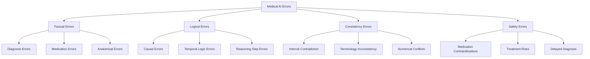

# CuraView

**English** | [中文](README.zh-CN.md)

> An integrated research platform for medical LLM hallucination detection, generation, and evaluation based on multi-agent architecture and GraphRAG knowledge graphs

[](LICENSE)
[](https://www.python.org/)
[](https://github.com/microsoft/graphrag)
[](https://www.langchain.com/)

---

## Overview

**CuraView** is an innovative research platform for medical AI hallucination detection and correction, dedicated to addressing the reliability and safety issues of medical large language model (LLM) outputs. By building a complete **Hallucination Generation -> Knowledge Graph Construction -> Intelligent Detection -> System Evaluation** pipeline, it provides technical safeguards for the clinical application of medical AI.

### Key Innovations

- **Hallucination Generation Agent**: Intelligent hallucination rewriting system based on LangChain 1.0, generating 7 types of medical error data
- **GraphRAG Knowledge Graph**: Medical knowledge graph built on Microsoft GraphRAG, supporting entity relationship extraction and vector retrieval
- **Hallucination Detection Agent**: Context-enhanced detection system combining GraphRAG, supporting both local model and API dual modes
- **System Integration & Evaluation**: Complete comparison and verification tools, supporting multi-model performance evaluation and recall analysis
- **EHR Data Processing**: Efficient electronic health record data processing toolchain, supporting the MIMIC-IV dataset
- **Model Fine-tuning Framework**: Medical domain model adaptation training integrated with MS-SWIFT

---

## Core Features

### 1. Hallucination Generation Agent

Automatically rewrites patient discharge summaries with hallucinations, generating training data containing 7 types of subtle medical errors.

#### Context Engineering Strategy

```
Context Engineering:
├── Medical background knowledge injection
├── Clinical experience case reference
├── Multi-modal information fusion (text + images + lab data)
├── Specialty domain specialization (internal medicine / surgery / emergency / imaging)
└── Real-time knowledge base updates
```

#### 7 Hallucination Types

1. **diagnosis_error** - Diagnosis-related errors (e.g., diabetes changed to hypertension)
2. **medication_error** - Medication errors (e.g., aspirin changed to penicillin)
3. **exam_result_error** - Examination result errors (e.g., negative changed to positive)
4. **time_error** - Time-related errors (e.g., 3 days changed to 7 days)
5. **value_error** - Numerical value errors (e.g., 120/80 changed to 180/120)
6. **negation_error** - Negation/polarity errors (e.g., "no" changed to "yes")
7. **invented_fact** - Completely fabricated medical events

#### Medical Error Classification Tree


```mermaid
graph TD
    A[Medical AI Errors] --> B[Factual Errors]
    A --> C[Logical Errors]
    A --> D[Consistency Errors]
    A --> E[Safety Errors]

    B --> B1[Diagnosis Errors]
    B --> B2[Medication Errors]
    B --> B3[Anatomical Errors]

    C --> C1[Causal Errors]
    C --> C2[Temporal Logic Errors]
    C --> C3[Reasoning Step Errors]

    D --> D1[Internal Contradiction]
    D --> D2[Terminology Inconsistency]
    D --> D3[Numerical Conflicts]

    E --> E1[Medication Contraindications]
    E --> E2[Treatment Risks]
    E --> E3[Delayed Diagnosis]
```

#### Output Format

```json
{
  "patient_id": "patient_2",
  "total_sentences": 14,
  "hallucinated_count": 3,
  "hallucination_ratio": 0.214,
  "hallucinated_indices": [2, 5, 10],
  "last_updated": "2026-01-01T12:00:00",
  "records": [
    {
      "sentence_index": 2,
      "original": "Patient diagnosed with Type 2 Diabetes",
      "rewritten": "Patient diagnosed with hypertension",
      "hallucination_type": "diagnosis_error",
      "explanation": "Incorrectly changed diabetes to hypertension"
    }
  ]
}
```

#### Usage Examples

```bash
# Process a single patient
echo "1" | python main.py

# Process consecutive patients (15-30)
echo "15 30" | python main.py
```

---

### 2. GraphRAG Knowledge Graph

Builds a medical domain knowledge graph based on Microsoft GraphRAG, supporting entity-relationship extraction, community detection, and vector retrieval.

#### Architecture Flow

```
EHR JSON Data
    ↓
Text Chunking (chunk_size=1200, overlap=100)
    ↓
Entity Extraction (patient / diagnosis / symptom / medication / procedure, etc.)
    ↓
Relationship Extraction (has_diagnosis, prescribed, performed, etc.)
    ↓
Community Detection (Leiden algorithm)
    ↓
Vector Embedding (text-embedding-v3)
    ↓
LanceDB Storage
    ↓
LocalSearch / GlobalSearch Query
```

#### Entity Type Definitions

```yaml
entity_types:
  - patient          # Patient
  - diagnosis        # Diagnosis
  - symptom          # Symptom
  - medication       # Medication
  - procedure        # Procedure/Operation
  - vital_sign       # Vital Sign
  - test_result      # Test Result
  - body_part        # Body Part
  - treatment_plan   # Treatment Plan
```

#### Query Examples

```python
from graphrag.query import LocalSearch, GlobalSearch

# Local search (for specific entities)
local_search = LocalSearch(config)
result = local_search.search("What is the patient's primary diagnosis?")

# Global search (macro questions)
global_search = GlobalSearch(config)
result = global_search.search("What are the most common diagnoses in the emergency department?")
```

#### Configuration File (settings.yaml)

```yaml
models:
  default_chat_model:
    model: qwen-plus
    api_base: https://dashscope.aliyuncs.com/compatible-mode/v1
  default_embedding_model:
    model: text-embedding-v3

chunks:
  size: 1200
  overlap: 100

extract_graph:
  prompt: prompts/Medical_Custom_EHR/extract_graph.txt
  entity_types: [patient, diagnosis, symptom, medication, procedure]
  max_gleanings: 1

vector_store:
  default_vector_store:
    type: lancedb
    db_uri: output/lancedb
```

---

### 3. Hallucination Detection Agent

Context-enhanced hallucination detection combining GraphRAG knowledge graphs, supporting both local model and API dual modes.

#### Multi-Layer Hallucination Detection Architecture

```
Detection Framework:
├── Semantic Consistency Detection: Fact verification based on medical knowledge graph
├── Logical Coherence Detection: Reasoning chain path verification
├── Context Relevance Detection: RAG recall content comparison analysis
├── Terminology Accuracy: Medical dictionary + ontology matching
└── Clinical Safety Detection: Risk assessment + contraindication checking
```

#### Detection Pipeline

```
Rewritten Text (rewritten_discharge.txt)
    ↓
Sentence Splitting (unified splitting logic)
    ↓
Per-Sentence GraphRAG Query (obtain contextual evidence)
    ↓
LLM Hallucination Detection (structured output)
    ↓
Generate Detection Report (JSON format)
```

#### Evidence Level Definitions

- **E0**: No Evidence - GraphRAG found no relevant information
- **E1**: Weak Evidence - Partially relevant but not directly supporting
- **E2**: Moderate Evidence - Relevant information with some ambiguity
- **E3**: Strong Evidence - Directly supports or refutes
- **E4**: Absolute Evidence - Complete factual match

#### Detection Result Example

```json
{
  "patient_id": "patient_2",
  "total_sentences": 14,
  "hallucination_count": 3,
  "hallucination_ratio": 0.214,
  "last_updated": "2026-01-01T12:30:00",
  "results": [
    {
      "sentence_index": 2,
      "sentence": "Patient diagnosed with hypertension",
      "is_hallucination": true,
      "hallucination_type": "diagnosis_error",
      "evidence_level": "E4",
      "reasoning": "GraphRAG shows patient actually has Type 2 Diabetes, contradicting current sentence",
      "graphrag_context": "patient_2 has_diagnosis Type 2 Diabetes"
    }
  ]
}
```

#### Configuration Options (config.yaml)

```yaml
llm:
  mode: api  # api or local
  api:
    model: qwen-plus
    temperature: 0.1
    max_tokens: 4000
  local:
    model_path: /path/to/local/model
    device: cuda

graphrag:
  mode: local_search
  search_type: local
  max_context_tokens: 3000

parallel_detection:
  enabled: true
  max_workers: 4
```

---

### 4. System Integration & Evaluation

Compares outputs of hallucination generation and detection systems, validating consistency and performance metrics.

#### Core Technical Breakthroughs

```
Innovation Points:
├── Multi-Agent Collaboration: Detection -> Classification -> Correction closed-loop system
├── Medical Knowledge Graph: Intelligent application of structured medical knowledge
├── Context Engineering: Prompt engineering methods for specialized medical domains
├── Joint Learning: End-to-end training of generation + detection + correction
└── RAG Enhancement: Intelligent retrieval application of real-time medical knowledge base
```

#### Evaluation Metrics

- **Recall**: Detected hallucinations / Injected hallucinations
- **Precision**: Correctly identified hallucinations / Total detected hallucinations
- **F1 Score**: Harmonic mean of recall and precision
- **Sentence Count Consistency**: Whether sentence splitting is consistent between systems

#### Usage Examples

```bash
# Interactive mode
./run_compare.sh

# Command line mode
python compare_systems.py --model qwen-plus --patient 1
python compare_systems.py --model qwen3-14b-base --patient "1 10"
python compare_systems.py --model qwen-plus --all
```

#### Output Structure

```
output/
├── qwen-plus/
│   ├── patient_1_comparison_20260101_164811_qwen-plus.json  # Detailed comparison
│   ├── patient_1_comparison_20260101_164811_qwen-plus.txt   # Readable report
│   └── summary_20260101_164900_qwen-plus.json               # Summary statistics
├── qwen3-14b-base/
│   └── ...
└── qwen3-8b-base/
    └── ...
```

#### Comparison Report Example

```
================================================================================
Patient patient_2 - System Comparison Report
================================================================================

Basic Information
────────────────────────────────────────
  Generation system sentences: 14
  Detection system sentences: 14
  Sentence count consistency: OK

Hallucination Statistics
────────────────────────────────────────
  Generated hallucinations: 3
  Detected hallucinations: 2
  Correct detections: 2
  Missed detections: 1

Performance Metrics
────────────────────────────────────────
  Recall: 66.67%
  Precision: 100.00%
  F1 Score: 80.00%

Detailed Comparison
────────────────────────────────────────
  Sentence 2: Diagnosis error
    Generation system: diagnosis_error
    Detection system: diagnosis_error - Correct
    Evidence level: E4

  Sentence 5: Medication error
    Generation system: medication_error
    Detection system: medication_error - Correct
    Evidence level: E3

  Sentence 10: Numerical error
    Generation system: value_error
    Detection system: Not detected - Missed
```

---

### Intelligent Correction Model

Intelligent hallucination correction system based on GraphRAG, providing automated error correction suggestions.

#### Correction Model Architecture

```python
class MedicalHallucinationCorrector:
    """
    Medical Hallucination Intelligent Correction System
    """
    def __init__(self):
        self.detector = HallucinationDetector()
        self.classifier = ErrorClassifier()
        self.rag_retriever = GraphRAGRetriever()
        self.corrector = CorrectionGenerator()

    def correct_pipeline(self, medical_text):
        # Step 1: Hallucination detection
        errors = self.detector.detect(medical_text)

        # Step 2: Error classification
        error_types = self.classifier.classify(errors)

        # Step 3: GraphRAG knowledge recall
        contexts = self.rag_retriever.local_search(medical_text, errors)

        # Step 4: Intelligent correction
        corrections = self.corrector.generate(
            text=medical_text,
            errors=errors,
            types=error_types,
            contexts=contexts
        )

        return {
            "error_positions": errors,
            "error_types": error_types,
            "correction_suggestions": corrections,
            "rewritten_text": self.rewrite(medical_text, corrections),
            "knowledge_sources": contexts["sources"]
        }
```

#### Correction Strategies

- **Factual Error Correction**: Fact verification and replacement based on GraphRAG knowledge graph
- **Logical Error Correction**: Reasoning chain reconstruction and causal relationship correction
- **Consistency Error Correction**: Terminology unification and numerical calibration
- **Safety Error Correction**: Contraindication checking and risk warnings

---

### 5. EHR Data Processing Tool

Integrates MIMIC-IV multi-table CSV data into a patient-centered JSON format.

#### Supported Data Tables

| Table | Description | Key Fields |
|-------|-------------|------------|
| diagnosis.csv | Diagnosis information | subject_id, icd_code, icd_title |
| discharge.csv | Discharge summary text | subject_id, note_id, text |
| discharge_target.csv | Target discharge sections | subject_id, brief_hospital_course, discharge_instructions |
| edstays.csv | Emergency department records | subject_id, stay_id, intime, outtime |
| radiology.csv | Radiology reports | subject_id, stay_id, text |
| triage.csv | Triage with vital signs | subject_id, temperature, heartrate |

#### Usage Example

```bash
cd scripts/ehr_json_builder

# Process training set data
python quick_start.py \
  Dataset/discharge-me/train \
  ./output \
  --chunksize 20000

# Validate output data
python script/validate_ehr_data.py --output_dir ./output

# View statistics report
cat output/processing_report.txt
```

#### Output Format

```json
{
  "patient_1": {
    "subject_id": "10000032",
    "stay_id": "39553267",
    "diagnosis": [
      {
        "icd_code": "E119",
        "icd_title": "Type 2 diabetes mellitus without complications"
      }
    ],
    "medications": [
      {
        "name": "Metformin",
        "gsn": "021748"
      }
    ],
    "vitals": {
      "temperature": 36.7,
      "heartrate": 88,
      "resprate": 18,
      "o2sat": 98,
      "sbp": 130,
      "dbp": 82
    },
    "triage": {
      "acuity": 3,
      "chiefcomplaint": "Shortness of breath"
    },
    "discharge": "Patient was admitted with..."
  }
}
```

---

## License

This project is licensed under the **MIT License** - see the [LICENSE](LICENSE) file for details.

---

## Contact

- **Project Lead**: Severin Ye
- **GitHub**: [@severin-ye](https://github.com/severin-ye)
- **Email**: [6severin9@gmail.com](mailto:6severin9@gmail.com)
- **Research Direction**: Medical AI safety, hallucination detection, intelligent correction systems

---

## Related Links

- [MS-Swift Official Repository](https://github.com/modelscope/ms-swift)
- [Microsoft GraphRAG](https://github.com/microsoft/graphrag)
- [LangChain Official Documentation](https://python.langchain.com/)
- [MIMIC-IV Dataset](https://physionet.org/content/mimic-iv-ed/)
- [Qwen Model Series](https://github.com/QwenLM/Qwen)

---

## Citation

If this project is helpful to your research, please consider citing:

```bibtex
@misc{curaview2026,
  title  = {CuraView: A Medical AI Hallucination Detection and Correction System Based on GraphRAG},
  author = {Ye, Severin and Contributors},
  year   = {2026},
  url    = {https://github.com/severin-ye/CuraView},
  note   = {An integrated research platform for hallucination detection, generation, and evaluation in medical large language models}
}
```

---

<div align="center">

**If this project helps you, please give us a Star!**

[](https://github.com/severin-ye/CuraView/stargazers)
[](https://github.com/severin-ye/CuraView/network/members)
[](https://github.com/severin-ye/CuraView/issues)

**Advancing medical AI safety research together, making AI better serve human health!**

</div>
