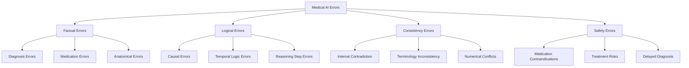

# CuraView

**English** | [中文](README.zh-CN.md)

> An integrated research platform for medical LLM hallucination detection, generation, and evaluation based on multi-agent architecture and GraphRAG knowledge graphs

[](LICENSE)
[](https://www.python.org/)
[](https://github.com/microsoft/graphrag)
[](https://www.langchain.com/)

---

## Overview

**CuraView** is an innovative research platform for medical AI hallucination detection and correction, dedicated to addressing the reliability and safety issues of medical large language model (LLM) outputs. By building a complete **Hallucination Generation -> Knowledge Graph Construction -> Intelligent Detection -> System Evaluation** pipeline, it provides technical safeguards for the clinical application of medical AI.

### Key Innovations

- **Hallucination Generation Agent**: Intelligent hallucination rewriting system based on LangChain 1.0, generating 7 types of medical error data
- **GraphRAG Knowledge Graph**: Medical knowledge graph built on Microsoft GraphRAG, supporting entity relationship extraction and vector retrieval
- **Hallucination Detection Agent**: Context-enhanced detection system combining GraphRAG, supporting both local model and API dual modes
- **System Integration & Evaluation**: Complete comparison and verification tools, supporting multi-model performance evaluation and recall analysis
- **EHR Data Processing**: Efficient electronic health record data processing toolchain, supporting the MIMIC-IV dataset
- **Model Fine-tuning Framework**: Medical domain model adaptation training integrated with MS-SWIFT

---

---

## Quick Start

### 1. Environment Setup

```bash
# Clone the project
git clone https://github.com/severin-ye/CuraView.git
cd CuraView

# Activate virtual environment
source .env-RAG/bin/activate

# Install core dependencies
pip install -r requirements.txt

# Install GraphRAG
pip install graphrag

# Install MS-SWIFT (optional, for model fine-tuning)
pip install ms-swift -U
```

### 2. Configure API Key

```bash
# Set API key (for GraphRAG and LangChain Agent)
export GRAPHRAG_API_KEY="your_qwen_api_key_here"

# Or permanently configure in .bashrc
echo 'export GRAPHRAG_API_KEY="your_key"' >> ~/.bashrc
source ~/.bashrc
```

### 3. Prepare Data

```bash
# Process MIMIC-IV dataset
cd scripts/ehr_json_builder
python quick_start.py Dataset/discharge-me/train ./output --chunksize 20000

# Validate data quality
python script/validate_ehr_data.py --output_dir ./output
```

### 4. Build GraphRAG Knowledge Graph

```bash
# Enter GraphRAG directory
cd graphrag

# Prepare input data (convert from EHR data)
# Copy processed data to input directory
cp ../Dataset/discharge-me_with_person_in_json/ehr_dataset_full.json input/

# Build knowledge graph index
graphrag index --root .

# Wait for index build to complete (may take several hours depending on data volume)
```

### 5. Run Hallucination Generation Agent

```bash
cd langchain/hallucination_generation_medical_agent

# Interactive mode
python main.py

# Non-interactive mode (process patient_2)
echo "2" | python main.py

# Or use script
./run.sh 2
```

### 6. Run Hallucination Detection Agent

```bash
cd langchain/hallucination_detection_graphrag_agent

# Interactive mode
./run.sh

# Select patient ID (e.g., 2 or 10 35 for range)
```

### 7. System Integration & Evaluation

```bash
cd experiment/generation_detection_integration

# Interactive integration
./run_compare.sh

# Or run Python script directly
python compare_systems.py
```

---

## Core Features

### 1. Hallucination Generation Agent

**Location**: `langchain/hallucination_generation_medical_agent/`

**Function**: Automatically rewrites patient discharge summaries with hallucinations, generating training data containing 7 types of subtle medical errors.

#### Context Engineering Strategy

```
Context Engineering:
├── Medical background knowledge injection
├── Clinical experience case reference
├── Multi-modal information fusion (text + images + lab data)
├── Specialty domain specialization (internal medicine / surgery / emergency / imaging)
└── Real-time knowledge base updates
```

#### 7 Hallucination Types

1. **diagnosis_error** - Diagnosis-related errors (e.g., diabetes changed to hypertension)
2. **medication_error** - Medication errors (e.g., aspirin changed to penicillin)
3. **exam_result_error** - Examination result errors (e.g., negative changed to positive)
4. **time_error** - Time-related errors (e.g., 3 days changed to 7 days)
5. **value_error** - Numerical value errors (e.g., 120/80 changed to 180/120)
6. **negation_error** - Negation/polarity errors (e.g., "no" changed to "yes")
7. **invented_fact** - Completely fabricated medical events

#### Medical Error Classification Tree


```mermaid
graph TD
    A[Medical AI Errors] --> B[Factual Errors]
    A --> C[Logical Errors]
    A --> D[Consistency Errors]
    A --> E[Safety Errors]

    B --> B1[Diagnosis Errors]
    B --> B2[Medication Errors]
    B --> B3[Anatomical Errors]

    C --> C1[Causal Errors]
    C --> C2[Temporal Logic Errors]
    C --> C3[Reasoning Step Errors]

    D --> D1[Internal Contradiction]
    D --> D2[Terminology Inconsistency]
    D --> D3[Numerical Conflicts]

    E --> E1[Medication Contraindications]
    E --> E2[Treatment Risks]
    E --> E3[Delayed Diagnosis]
```

#### Output Format

```json
{
  "patient_id": "patient_2",
  "total_sentences": 14,
  "hallucinated_count": 3,
  "hallucination_ratio": 0.214,
  "hallucinated_indices": [2, 5, 10],
  "last_updated": "2026-01-01T12:00:00",
  "records": [
    {
      "sentence_index": 2,
      "original": "Patient diagnosed with Type 2 Diabetes",
      "rewritten": "Patient diagnosed with hypertension",
      "hallucination_type": "diagnosis_error",
      "explanation": "Incorrectly changed diabetes to hypertension"
    }
  ]
}
```

#### Usage Examples

```bash
# Process a single patient
echo "1" | python main.py

# Process consecutive patients (15-30)
echo "15 30" | python main.py
```

---

### 2. GraphRAG Knowledge Graph

**Location**: `graphrag/`

**Function**: Builds a medical domain knowledge graph based on Microsoft GraphRAG, supporting entity-relationship extraction, community detection, and vector retrieval.

#### Architecture Flow

```
EHR JSON Data
    ↓
Text Chunking (chunk_size=1200, overlap=100)
    ↓
Entity Extraction (patient / diagnosis / symptom / medication / procedure, etc.)
    ↓
Relationship Extraction (has_diagnosis, prescribed, performed, etc.)
    ↓
Community Detection (Leiden algorithm)
    ↓
Vector Embedding (text-embedding-v3)
    ↓
LanceDB Storage
    ↓
LocalSearch / GlobalSearch Query
```

#### Entity Type Definitions

```yaml
entity_types:
  - patient          # Patient
  - diagnosis        # Diagnosis
  - symptom          # Symptom
  - medication       # Medication
  - procedure        # Procedure/Operation
  - vital_sign       # Vital Sign
  - test_result      # Test Result
  - body_part        # Body Part
  - treatment_plan   # Treatment Plan
```

#### Query Examples

```python
from graphrag.query import LocalSearch, GlobalSearch

# Local search (for specific entities)
local_search = LocalSearch(config)
result = local_search.search("What is the patient's primary diagnosis?")

# Global search (macro questions)
global_search = GlobalSearch(config)
result = global_search.search("What are the most common diagnoses in the emergency department?")
```

#### Configuration File (settings.yaml)

```yaml
models:
  default_chat_model:
    model: qwen-plus
    api_base: https://dashscope.aliyuncs.com/compatible-mode/v1
  default_embedding_model:
    model: text-embedding-v3

chunks:
  size: 1200
  overlap: 100

extract_graph:
  prompt: prompts/Medical_Custom_EHR/extract_graph.txt
  entity_types: [patient, diagnosis, symptom, medication, procedure]
  max_gleanings: 1

vector_store:
  default_vector_store:
    type: lancedb
    db_uri: output/lancedb
```

---

### 3. Hallucination Detection Agent

**Location**: `langchain/hallucination_detection_graphrag_agent/`

**Function**: Context-enhanced hallucination detection combining GraphRAG knowledge graphs, supporting both local model and API dual modes.

#### Multi-Layer Hallucination Detection Architecture

```
Detection Framework:
├── Semantic Consistency Detection: Fact verification based on medical knowledge graph
├── Logical Coherence Detection: Reasoning chain path verification
├── Context Relevance Detection: RAG recall content comparison analysis
├── Terminology Accuracy: Medical dictionary + ontology matching
└── Clinical Safety Detection: Risk assessment + contraindication checking
```

#### Detection Pipeline

```
Rewritten Text (rewritten_discharge.txt)
    ↓
Sentence Splitting (unified splitting logic)
    ↓
Per-Sentence GraphRAG Query (obtain contextual evidence)
    ↓
LLM Hallucination Detection (structured output)
    ↓
Generate Detection Report (JSON format)
```

#### Evidence Level Definitions

- **E0**: No Evidence - GraphRAG found no relevant information
- **E1**: Weak Evidence - Partially relevant but not directly supporting
- **E2**: Moderate Evidence - Relevant information with some ambiguity
- **E3**: Strong Evidence - Directly supports or refutes
- **E4**: Absolute Evidence - Complete factual match

#### Detection Result Example

```json
{
  "patient_id": "patient_2",
  "total_sentences": 14,
  "hallucination_count": 3,
  "hallucination_ratio": 0.214,
  "last_updated": "2026-01-01T12:30:00",
  "results": [
    {
      "sentence_index": 2,
      "sentence": "Patient diagnosed with hypertension",
      "is_hallucination": true,
      "hallucination_type": "diagnosis_error",
      "evidence_level": "E4",
      "reasoning": "GraphRAG shows patient actually has Type 2 Diabetes, contradicting current sentence",
      "graphrag_context": "patient_2 has_diagnosis Type 2 Diabetes"
    }
  ]
}
```

#### Configuration Options (config.yaml)

```yaml
llm:
  mode: api  # api or local
  api:
    model: qwen-plus
    temperature: 0.1
    max_tokens: 4000
  local:
    model_path: /path/to/local/model
    device: cuda

graphrag:
  mode: local_search
  search_type: local
  max_context_tokens: 3000

parallel_detection:
  enabled: true
  max_workers: 4
```

---

### 4. System Integration & Evaluation

**Location**: `experiment/generation_detection_integration/`

**Function**: Compares outputs of hallucination generation and detection systems, validating consistency and performance metrics.

#### Core Technical Breakthroughs

```
Innovation Points:
├── Multi-Agent Collaboration: Detection -> Classification -> Correction closed-loop system
├── Medical Knowledge Graph: Intelligent application of structured medical knowledge
├── Context Engineering: Prompt engineering methods for specialized medical domains
├── Joint Learning: End-to-end training of generation + detection + correction
└── RAG Enhancement: Intelligent retrieval application of real-time medical knowledge base
```

#### Evaluation Metrics

- **Recall**: Detected hallucinations / Injected hallucinations
- **Precision**: Correctly identified hallucinations / Total detected hallucinations
- **F1 Score**: Harmonic mean of recall and precision
- **Sentence Count Consistency**: Whether sentence splitting is consistent between systems

#### Usage Examples

```bash
# Interactive mode
./run_compare.sh

# Command line mode
python compare_systems.py --model qwen-plus --patient 1
python compare_systems.py --model qwen3-14b-base --patient "1 10"
python compare_systems.py --model qwen-plus --all
```

#### Output Structure

```
output/
├── qwen-plus/
│   ├── patient_1_comparison_20260101_164811_qwen-plus.json  # Detailed comparison
│   ├── patient_1_comparison_20260101_164811_qwen-plus.txt   # Readable report
│   └── summary_20260101_164900_qwen-plus.json               # Summary statistics
├── qwen3-14b-base/
│   └── ...
└── qwen3-8b-base/
    └── ...
```

#### Comparison Report Example

```
================================================================================
Patient patient_2 - System Comparison Report
================================================================================

Basic Information
────────────────────────────────────────
  Generation system sentences: 14
  Detection system sentences: 14
  Sentence count consistency: OK

Hallucination Statistics
────────────────────────────────────────
  Generated hallucinations: 3
  Detected hallucinations: 2
  Correct detections: 2
  Missed detections: 1

Performance Metrics
────────────────────────────────────────
  Recall: 66.67%
  Precision: 100.00%
  F1 Score: 80.00%

Detailed Comparison
────────────────────────────────────────
  Sentence 2: Diagnosis error
    Generation system: diagnosis_error
    Detection system: diagnosis_error - Correct
    Evidence level: E4

  Sentence 5: Medication error
    Generation system: medication_error
    Detection system: medication_error - Correct
    Evidence level: E3

  Sentence 10: Numerical error
    Generation system: value_error
    Detection system: Not detected - Missed
```

---

### Intelligent Correction Model (Planned)

**Location**: Planned module

**Function**: Intelligent hallucination correction system based on GraphRAG, providing automated error correction suggestions.

#### Correction Model Architecture

```python
class MedicalHallucinationCorrector:
    """
    Medical Hallucination Intelligent Correction System
    """
    def __init__(self):
        self.detector = HallucinationDetector()
        self.classifier = ErrorClassifier()
        self.rag_retriever = GraphRAGRetriever()
        self.corrector = CorrectionGenerator()

    def correct_pipeline(self, medical_text):
        # Step 1: Hallucination detection
        errors = self.detector.detect(medical_text)

        # Step 2: Error classification
        error_types = self.classifier.classify(errors)

        # Step 3: GraphRAG knowledge recall
        contexts = self.rag_retriever.local_search(medical_text, errors)

        # Step 4: Intelligent correction
        corrections = self.corrector.generate(
            text=medical_text,
            errors=errors,
            types=error_types,
            contexts=contexts
        )

        return {
            "error_positions": errors,
            "error_types": error_types,
            "correction_suggestions": corrections,
            "rewritten_text": self.rewrite(medical_text, corrections),
            "knowledge_sources": contexts["sources"]
        }
```

#### Correction Strategies

- **Factual Error Correction**: Fact verification and replacement based on GraphRAG knowledge graph
- **Logical Error Correction**: Reasoning chain reconstruction and causal relationship correction
- **Consistency Error Correction**: Terminology unification and numerical calibration
- **Safety Error Correction**: Contraindication checking and risk warnings

---

### 5. EHR Data Processing Tool

**Location**: `scripts/ehr_json_builder/`

**Function**: Integrates MIMIC-IV multi-table CSV data into a patient-centered JSON format.

#### Supported Data Tables

| Table | Description | Key Fields |
|-------|-------------|------------|
| diagnosis.csv | Diagnosis information | subject_id, icd_code, icd_title |
| discharge.csv | Discharge summary text | subject_id, note_id, text |
| discharge_target.csv | Target discharge sections | subject_id, brief_hospital_course, discharge_instructions |
| edstays.csv | Emergency department records | subject_id, stay_id, intime, outtime |
| radiology.csv | Radiology reports | subject_id, stay_id, text |
| triage.csv | Triage with vital signs | subject_id, temperature, heartrate |

#### Usage Example

```bash
cd scripts/ehr_json_builder

# Process training set data
python quick_start.py \
  Dataset/discharge-me/train \
  ./output \
  --chunksize 20000

# Validate output data
python script/validate_ehr_data.py --output_dir ./output

# View statistics report
cat output/processing_report.txt
```

#### Output Format

```json
{
  "patient_1": {
    "subject_id": "10000032",
    "stay_id": "39553267",
    "diagnosis": [
      {
        "icd_code": "E119",
        "icd_title": "Type 2 diabetes mellitus without complications"
      }
    ],
    "medications": [
      {
        "name": "Metformin",
        "gsn": "021748"
      }
    ],
    "vitals": {
      "temperature": 36.7,
      "heartrate": 88,
      "resprate": 18,
      "o2sat": 98,
      "sbp": 130,
      "dbp": 82
    },
    "triage": {
      "acuity": 3,
      "chiefcomplaint": "Shortness of breath"
    },
    "discharge": "Patient was admitted with..."
  }
}
```

---

## Application Scenarios & Value

### Clinical Applications

#### Intelligent Diagnosis Assistance
- **AI Diagnosis Verification**: Detect and correct hallucinations in AI-generated diagnostic reports
- **Treatment Plan Review**: Verify medical accuracy of AI-recommended treatment plans
- **Medication Safety Check**: Detect medication errors and contraindications in AI-prescribed prescriptions
- **Medical Record Quality Control**: Automated quality control and error correction of medical documentation

#### Medical Education & Training
- **Clinical Reasoning Training**: Enhance clinical reasoning skills through error case analysis
- **Medical Knowledge Verification**: Help medical students identify and correct medical knowledge misconceptions
- **Case Discussion Support**: Provide structured error analysis tools for medical education

#### Medical Safety Assurance
- **Risk Warning System**: Real-time detection of safety risks in medical AI outputs
- **Quality Monitoring**: Continuous monitoring of medical AI system output quality
- **Compliance Checking**: Ensure AI medical recommendations comply with clinical guidelines and standards

### Research Innovation Value

#### Academic Contributions
- **Novel Detection Methods**: Propose medical domain-specific hallucination detection algorithms
- **Error Classification System**: Build a systematic medical AI error classification standard
- **Correction Model Architecture**: Design an end-to-end medical text intelligent correction system
- **Evaluation Benchmark**: Establish a standard evaluation dataset for medical AI hallucination detection

### Industry Application Prospects

#### Medical AI Product Optimization
- **EMR System Enhancement**: Provide intelligent quality control for electronic medical record systems
- **AI Diagnostic Products**: Improve reliability and safety of AI diagnostic products
- **Medical Robots**: Provide safety assurance mechanisms for medical service robots
- **Telemedicine**: Ensure accuracy of remote medical AI consultations

#### Regulatory Compliance Support
- **AI Medical Review**: Provide technical support for medical AI product regulation
- **Quality Standards**: Establish quantitative evaluation standards for medical AI output quality
- **Safety Certification**: Provide verification tools for medical AI system safety certification

---

## Technology Stack

### Core Frameworks

```txt
# Deep Learning & NLP
torch>=2.0.0                    # PyTorch deep learning framework
transformers>=4.30.0            # HuggingFace model library
sentence-transformers           # Semantic similarity computation

# Agent Framework
langchain>=1.0.0                # LangChain multi-agent framework
langgraph                       # Agent state management
langchain-openai                # OpenAI API integration

# Knowledge Graph
graphrag>=0.3.0                 # Microsoft GraphRAG framework
lancedb>=0.3.0                  # Vector database
graspologic>=3.0.0              # Graph analysis & community detection
networkx>=2.8                   # Graph structure processing
pyarrow>=14.0.0                 # Parquet data storage

# Model Fine-tuning
ms-swift>=2.0.0                 # ModelScope fine-tuning framework
peft>=0.11                      # Parameter-Efficient Fine-Tuning
accelerate>=1.12.0              # Distributed training acceleration

# Data Processing
pandas>=1.5.0                   # Structured data processing
numpy>=1.21.0                   # Numerical computation
datasets>=2.10.0                # Dataset management

# API & Utilities
openai                          # OpenAI API
aiohttp                         # Async HTTP requests
pyyaml                          # YAML configuration files
pydantic>=2.0                   # Data validation & structured output
```

### System Requirements

- **Python**: 3.10+ (recommended 3.11)
- **Memory**: 32GB+ (training), 16GB+ (inference)
- **Storage**: 100GB+ (models + data + outputs)
- **GPU**: NVIDIA RTX 4090+ (inference), A100 (training)

---

## Performance Benchmarks

| Task | Performance | Hardware |
|------|------------|----------|
| EHR Data Processing | >1,000 patients/sec | CPU: 16 cores |
| GraphRAG Index Construction | ~2 hours / 10,000 patients | GPU: RTX 4090 |
| Hallucination Generation | ~5 sec / patient | API: qwen-plus |
| Hallucination Detection (Serial) | ~3 sec / sentence | API: qwen-plus |
| Hallucination Detection (Parallel) | ~1 sec / sentence (4 threads) | API: qwen-plus |
| Detection Recall | 70-85% | Depends on model and evidence level |

---

## Current Progress

### Completed (Phase 1-2)

#### Infrastructure
- [x] Complete Python development environment and dependency management
- [x] EHR data processing toolchain (46,998 patient records)
- [x] MIMIC-IV dataset processing and validation
- [x] Unified sentence splitting logic (shared_utils)

#### Hallucination Generation System
- [x] LangChain 1.0 multi-agent architecture
- [x] 7 medical hallucination type definitions
- [x] Intelligent sentence sampling and rewriting
- [x] Complete JSON output format
- [x] Timestamp and index fields
- [x] Non-interactive mode support

#### GraphRAG Knowledge Graph
- [x] Microsoft GraphRAG framework integration
- [x] Medical domain entity type definitions
- [x] Custom prompt templates
- [x] LanceDB vector storage
- [x] LocalSearch and GlobalSearch implementation
- [x] Qwen API integration

#### Hallucination Detection System
- [x] GraphRAG context-enhanced detection
- [x] Local model and API dual mode
- [x] Pydantic structured output
- [x] 4-level evidence grading definitions
- [x] Parallel detection support (ThreadPoolExecutor)
- [x] Detailed detection reports

#### System Integration & Evaluation
- [x] System comparison verification tools
- [x] Multi-model performance evaluation
- [x] Recall / Precision / F1 score calculation
- [x] Output structure organized by model
- [x] Interactive and CLI dual mode

### In Progress (Phase 3)

- [ ] Hallucination correction agent development
- [ ] Multi-strategy detection comparison experiments
- [ ] Large-scale dataset evaluation
- [ ] Model fine-tuning experiments (MS-SWIFT)

### Planned (Phase 4-5)

#### Phase 4: Intelligent Correction System
- [ ] GraphRAG-based correction suggestion generation
- [ ] Correction model training (joint learning)
- [ ] Human feedback loop (RLHF)
- [ ] End-to-end correction evaluation

#### Phase 5: Clinical Application
- [ ] Real clinical scenario testing
- [ ] Physician-annotated data collection
- [ ] Safety and reliability validation
- [ ] Production deployment plans

---

## Documentation Resources

### Core Documentation

| Document | Description | Location |
|----------|-------------|----------|
| MS-SWIFT Usage Guide | Detailed model fine-tuning tutorial | [docs/MS-SWIFT_Usage_Guide.md](docs/MS-SWIFT_Usage_Guide.md) |
| GraphRAG Prompts Customization Guide | Complete prompt customization guide | [docs/GraphRAG_Prompts_Guide.md](docs/GraphRAG_Prompts_Guide.md) |
| System Improvements Summary | System improvement notes | [docs/System_Improvements_Report.md](docs/System_Improvements_Report.md) |
| Environment Fix Guide | Common issue solutions | [docs/Environment_Fix_Guide.md](docs/Environment_Fix_Guide.md) |
| Detection Performance Optimization Guide | Performance optimization best practices | [docs/Detection_Performance_Guide.md](docs/Detection_Performance_Guide.md) |

### Module Documentation

| Module | README Location |
|--------|-----------------|
| Hallucination Generation Agent | [langchain/hallucination_generation_medical_agent/README.md](langchain/hallucination_generation_medical_agent/README.md) |
| Hallucination Detection Agent | [langchain/hallucination_detection_graphrag_agent/README.md](langchain/hallucination_detection_graphrag_agent/README.md) |
| System Integration Tool | [experiment/generation_detection_integration/README.md](experiment/generation_detection_integration/README.md) |
| EHR Data Processing | [scripts/ehr_json_builder/README.md](scripts/ehr_json_builder/README.md) |
| Meditron Evaluation | [Meditron-7B/README.md](Meditron-7B/README.md) |

### Tutorials

- [GraphRAG Quick Start & Principles](docs/tutorials/graphRAG/1.GraphRAG_Quick_Start.ipynb)
- [Ollama + GraphRAG Local Deployment](docs/tutorials/graphRAG/3.Ollama_GraphRAG_Local_Deploy.ipynb)

---

## Troubleshooting

### Common Issues

#### 1. API Key Not Set

```bash
# Error message
ValueError: Please set environment variable: GRAPHRAG_API_KEY

# Solution
export GRAPHRAG_API_KEY="your_key_here"
```

#### 2. GraphRAG Index Not Built

```bash
# Error message
FileNotFoundError: output/index_output/create_final_entities.parquet

# Solution
cd graphrag
graphrag index --root .
```

#### 3. Sentence Count Mismatch

```bash
# Problem: Generation and detection systems output different sentence counts

# Solution: Ensure unified sentence splitting logic is used
# Both systems should import from shared_utils/sentence_splitter.py
```

#### 4. Parallel Detection Error

```bash
# Error message
RuntimeError: Thread pool execution error

# Solution: Disable parallel mode
# In config.yaml, set:
parallel_detection:
  enabled: false
```

#### 5. Out of Memory

```bash
# Problem: Out of memory when processing large datasets

# Solution 1: Reduce chunk size
python quick_start.py --chunksize 10000

# Solution 2: Use streaming mode
# Enable streaming mode in code
```

---

## Contributing

Community contributions are welcome! Ways to participate:

### Code Contributions

```bash
# 1. Fork the project
# 2. Create a feature branch
git checkout -b feature/new-feature

# 3. Commit changes
git commit -m "Add: new feature description"

# 4. Push to branch
git push origin feature/new-feature

# 5. Create a Pull Request
```

### Other Contribution Methods

- **Bug Reports**: Describe issues in detail on GitHub Issues
- **Feature Suggestions**: Propose new feature ideas and improvements
- **Documentation Improvements**: Refine project documentation and tutorials
- **Data Contributions**: Provide medical error case data
- **Academic Discussions**: Participate in methodology and algorithm improvement discussions

---

## Project Statistics

- **Code Volume**: 20,000+ lines of Python code
- **Data Processing Capacity**: 46,998 patient records
- **Model Support**: 4B-30B parameter scale
- **Documentation Coverage**: 15+ detailed documents and tutorials
- **Test Coverage**: Complete system verification framework
- **Knowledge Graph**: Built medical entity-relationship graph
- **Agent Systems**: 2 complete LangChain Agents
- **Evaluation Tools**: Complete performance evaluation system

---

## Expected Outcomes

### Technical Outcomes

- **Open-Source Toolkit**: Complete medical AI hallucination detection and correction system
- **Standard Dataset**: Medical hallucination detection benchmark dataset
- **Evaluation Framework**: Systematic medical AI quality assessment methods
- **Best Practices**: Medical AI safety deployment guide

### Academic Contributions

- **Top Conference Papers**: Targeting AAAI / IJCAI / ACL and other top AI conferences
- **Specialized Journals**: Medical informatics and AI medical journal publications
- **Technical Patents**: Core algorithm and system architecture patent applications
- **Open-Source Impact**: Advancing the medical AI safety research community

### Industry Value

- **Medical AI Products**: Provide safety assurance for commercial medical AI products
- **Regulatory Support**: Provide technical standards for medical AI regulation
- **Clinical Application**: Quality control tools for real medical scenarios
- **Education & Training**: Intelligent assistance systems for medical education

---

## License

This project is licensed under the **MIT License** - see the [LICENSE](LICENSE) file for details.

---

## Contact

- **Project Lead**: Severin Ye
- **GitHub**: [@severin-ye](https://github.com/severin-ye)
- **Email**: [6severin9@gmail.com](mailto:6severin9@gmail.com)
- **Research Direction**: Medical AI safety, hallucination detection, intelligent correction systems

---

## Related Links

- [MS-Swift Official Repository](https://github.com/modelscope/ms-swift)
- [Microsoft GraphRAG](https://github.com/microsoft/graphrag)
- [LangChain Official Documentation](https://python.langchain.com/)
- [MIMIC-IV Dataset](https://physionet.org/content/mimic-iv-ed/)
- [Qwen Model Series](https://github.com/QwenLM/Qwen)

---

## Citation

If this project is helpful to your research, please consider citing:

```bibtex
@misc{curaview2026,
  title  = {CuraView: A Medical AI Hallucination Detection and Correction System Based on GraphRAG},
  author = {Ye, Severin and Contributors},
  year   = {2026},
  url    = {https://github.com/severin-ye/CuraView},
  note   = {An integrated research platform for hallucination detection, generation, and evaluation in medical large language models}
}
```

---

<div align="center">

**If this project helps you, please give us a Star!**

[](https://github.com/severin-ye/CuraView/stargazers)
[](https://github.com/severin-ye/CuraView/network/members)
[](https://github.com/severin-ye/CuraView/issues)

**Advancing medical AI safety research together, making AI better serve human health!**

</div>

---

## Quick Experience

```bash
# One-click full pipeline startup

# 1. Environment setup
git clone https://github.com/severin-ye/CuraView.git && cd CuraView
source .env-RAG/bin/activate
pip install -r requirements.txt
export GRAPHRAG_API_KEY="your_key"

# 2. Build GraphRAG knowledge graph
cd graphrag
graphrag index --root .

# 3. Generate hallucination data
cd ../langchain/hallucination_generation_medical_agent
echo "1" | python main.py

# 4. Detect hallucinations
cd ../hallucination_detection_graphrag_agent
echo "1" | ./run.sh

# 5. System evaluation
cd ../../experiment/generation_detection_integration
python compare_systems.py --model qwen-plus --patient 1

# View results
cat output/qwen-plus/patient_1_comparison_*.txt
```

**Start exploring the safety boundaries of medical AI now!**
