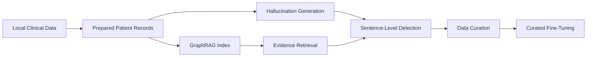

# CuraView

**A GraphRAG-Based Framework for Medical AI Hallucination Generation and Detection**

Official research code release for the paper:

> *"CuraView: A GraphRAG-Based Framework for Medical AI Hallucination Generation and Detection"*

[](#citation)
[](#code-status)
[](https://www.python.org/)
[](https://github.com/microsoft/graphrag)
[](https://www.langchain.com/)
[](#license)

---

## Overview

CuraView is a knowledge-based multi-agent framework for sentence-level medical hallucination detection in discharge summaries. It formulates hallucination detection as patient-grounded claim verification using GraphRAG-enhanced evidence retrieval and structured evidence grading (E1--E4).

### Key Features

- **Hallucination Generation Agent**: Controlled injection of 7 clinically meaningful hallucination types via LangChain
- **GraphRAG Knowledge Graph**: Patient-specific knowledge graphs built from heterogeneous EHR sources using Microsoft GraphRAG
- **Hallucination Detection Agent**: Evidence-grounded sentence-level verification with dual API/local model support
- **Structured Evidence Grading**: Four-level scheme (E1 strong support, E2 weak support, E3 no support, E4 direct contradiction)
- **Multi-Agent Curation Pipeline**: Generation--detection--curation workflow for producing quality-filtered training data
- **EHR Data Processing**: Toolchain for MIMIC-IV discharge-me dataset processing

---

## Code Status

**Code is being organized for public release.** Please check back later or watch this repository for updates.

---

## System Pipeline


```mermaid
graph LR
    localData["Local Clinical Data"] --> preparedRecords["Prepared Patient Records"]
    preparedRecords --> graphRagIndex["GraphRAG Index"]
    preparedRecords --> hallucinationGen["Hallucination Generation"]
    graphRagIndex --> evidenceRetrieve["Evidence Retrieval"]
    hallucinationGen --> detectionAgent["Sentence-Level Detection"]
    evidenceRetrieve --> detectionAgent
    detectionAgent --> curation["Data Curation"]
    curation --> fineTuning["Curated Fine-Tuning"]
```

The pipeline consists of five core stages:

1. **Evidence preparation**: Patient records are prepared from heterogeneous EHR sources
2. **Knowledge construction**: GraphRAG builds a patient-specific knowledge graph
3. **Hallucination generation**: The generation agent injects controlled medical errors (7 types)
4. **Evidence-grounded detection**: The detection agent classifies sentences using retrieved evidence (E1--E4)
5. **Data curation**: Quality-filtered supervision for improving local verification models

---

## Hallucination Types

CuraView covers seven clinically meaningful hallucination categories:

| Type | Description | Example |
|------|-------------|---------|
| `diagnosis_error` | Diagnosis errors | Diabetes changed to hypertension |
| `medication_error` | Medication errors | Aspirin changed to penicillin |
| `exam_result_error` | Examination/lab result errors | Negative changed to positive |
| `time_error` | Temporal errors | 3 days changed to 7 days |
| `value_error` | Numerical value errors | 120/80 changed to 180/120 |
| `negation_error` | Negation/polarity errors | "No" changed to "Yes" |
| `invented_fact` | Completely fabricated events | Fabricated medical procedures |

---

## Repository Structure

```
CuraView/
├── langchain/
│   ├── hallucination_generation_medical_agent/   # Controlled hallucination generation
│   │   ├── agent.py                              # Agent core logic
│   │   ├── main.py                               # Main entry point
│   │   ├── config.yaml                           # Configuration
│   │   └── tools/                                # Text processing and file management
│   │
│   ├── hallucination_detection_graphrag_agent/   # Evidence-grounded detection
│   │   ├── detect.py                             # Main entry point
│   │   ├── config.yaml                           # Configuration
│   │   ├── tools/                                # Sentence splitting and GraphRAG query
│   │   └── models/                               # Pydantic schemas and validators
│   │
│   └── shared_utils/                             # Shared sentence splitting utilities
│
├── graphrag/
│   ├── settings.yaml                             # GraphRAG configuration
│   ├── prompts/                                  # Medical prompt templates
│   ├── core/index/                               # Index construction
│   └── core/query/                               # Query and retrieval
│
├── Meditron-7B/                                  # Meditron generation/detection wrappers
├── ms-swift/                                     # LoRA training, merging, quantization
├── scripts/                                      # EHR data processing tools
└── requirements.txt
```

---

## Installation

```bash
git clone https://github.com/severin-ye/CuraView.git
cd CuraView

python3 -m venv .venv
source .venv/bin/activate

pip install --upgrade pip
pip install -r requirements.txt
```

### Requirements

| Component | Version |
|-----------|---------|
| Python | 3.10+ |
| Core frameworks | GraphRAG, LangChain, PyTorch, Transformers |
| Optional | CUDA-compatible GPU for local LLM inference |

---

## Quick Start

### 1. Configure API Key

```bash
export GRAPHRAG_API_KEY="your_api_key_here"
```

### 2. Build GraphRAG Index

```bash
cd graphrag
graphrag index --root .
cd ..
```

### 3. Generate Controlled Hallucinations

```bash
cd langchain/hallucination_generation_medical_agent
python main.py
cd ../..
```

### 4. Detect Hallucinations

```bash
cd langchain/hallucination_detection_graphrag_agent
python detect.py
cd ../..
```

### 5. System Evaluation

```bash
cd experiment/幻觉生成_幻觉检测_系统联调
python compare_systems.py
```

---

## Configuration

Primary configuration files:

| Component | Configuration |
|-----------|---------------|
| GraphRAG indexing and retrieval | `graphrag/settings.yaml` |
| Hallucination generation | `langchain/hallucination_generation_medical_agent/config.yaml` |
| Hallucination detection | `langchain/hallucination_detection_graphrag_agent/config.yaml` |
| MS-SWIFT training | `ms-swift/1_train/training_configs.yaml` |

Important configuration fields:

```yaml
llm:
  mode: api        # api or local
  api:
    model: qwen-plus
    api_key: ${GRAPHRAG_API_KEY}

detection:
  async_graphrag: true
  enable_batch_processing: true
  max_concurrent_queries: 5
```

**Do not store secrets in YAML files.** Use environment variables such as `GRAPHRAG_API_KEY`.

---

## Evidence Grading Scheme

CuraView uses a four-level evidence grading scheme for sentence-level verification:

| Grade | Meaning | Description |
|-------|---------|-------------|
| **E1** | Strong Support | Directly supported by patient EHR evidence |
| **E2** | Weak Support | Partially supported, some ambiguity |
| **E3** | No Support | No supporting evidence found |
| **E4** | Direct Contradiction | Directly contradicted by patient EHR evidence |

---

## Data Format

The core modules expect patient-centered records in the following format:

```json
{
  "patient_id": "patient_1",
  "discharge_text": "...",
  "discharge_evidence": "...",
  "diagnosis": [...],
  "medications": [...],
  "vitals": {...},
  "triage": {...}
}
```

---

## Related Repository

- **Dataset**: [CuraView-EVD](https://github.com/severin-ye/CuraView-EVD) - Evidence-annotated clinical hallucination dataset (coming soon)

---

## Results

Experimental results are not included in this repository. Results depend on local data, model weights or API versions, prompt revisions, and GraphRAG configuration. A future reproduction release may provide exact table and figure scripts.

---

## Citation

If you use CuraView, cite the repository and specify the exact commit hash used in your experiments.

```bibtex
@misc{curaview2026,
  title  = {CuraView: A GraphRAG-Based Framework for Medical AI Hallucination Generation and Detection},
  author = {Ye, Severin and Kong, Xiao and He, Xiaopeng and Yan, Guangsu and Peng, Limei and Oh, Dongsuk},
  year   = {2026},
  note   = {Official research code release},
  url    = {https://github.com/severin-ye/CuraView}
}
```

---

## License

- **Code**: MIT License, unless otherwise noted.
- **Clinical data**: Not redistributed; governed by the original data provider and data-use agreement.
- **Model weights and checkpoints**: Not redistributed; governed by the original model licenses.

---

## Contact

- **Repository maintainer**: Severin Ye
- **GitHub**: [@severin-ye](https://github.com/severin-ye)
- **Email**: [6severin9@gmail.com](mailto:6severin9@gmail.com)

For questions about the research code, open a GitHub issue or contact the repository maintainer.
